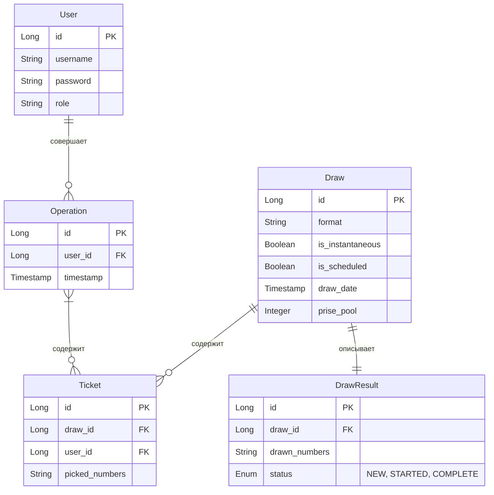
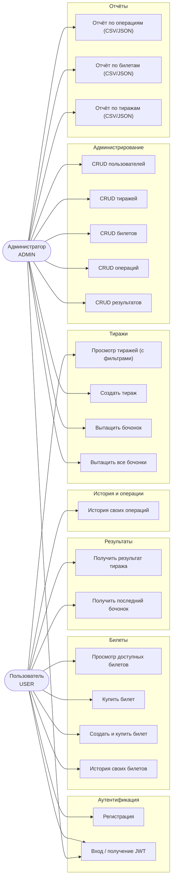

# SkillfactoryLottery

Бэкенд-система для проведения лотерейных тиражей. Реализует **Сценарий 3 — Лотерея с историей и аналитикой**.

Система позволяет проводить лотереи, в которых участвуют пользователи. Лотереи могут проводиться вручную или по расписанию (cron), мгновенно или с пошаговым вытаскиванием бочонков. Выигрыш рассчитывается автоматически.

---

## Стек технологий

- **Java 21**
- **Quarkus** (REST, Hibernate ORM Panache, SmallRye JWT, Scheduler)
- **PostgreSQL 16**
- **Gradle**
- **Docker / Docker Compose**
- **Lombok**

---

## Архитектура и модель данных

Проект разделён на слои: **контроллеры (Resource)** → **бизнес-логика (Service)** → **доступ к данным (Repository / Panache Entity)**.

### Основные сущности



---

## Use-Case диаграмма



---

## Запуск проекта

### 1. Поднять базу данных через Docker Compose

```bash
docker compose up -d
```

Это запустит PostgreSQL 16 на порту `5432` с параметрами:

| Параметр     | Значение    |
|--------------|-------------|
| База данных  | `sflottery` |
| Пользователь | `user`      |
| Пароль       | `password`  |
| Порт         | `5432`      |

### 2. Запустить приложение через Gradle

**В режиме разработки (dev mode):**
```bash
./gradlew quarkusDev
```

**Сборка и запуск в production-режиме:**
```bash
./gradlew build
java -jar build/quarkus-app/quarkus-run.jar
```

> Приложение запустится на `http://localhost:8080`

---

## Авторизация (JWT)

В проекте используется аутентификация на основе **JWT-токенов** (SmallRye JWT).

### Получение токена

**1. Регистрация:**
```http
POST /auth/register
Content-Type: application/json

{
  "username": "john",
  "password": "secret123"
}
```

**2. Вход:**
```http
POST /auth/login
Content-Type: application/json

{
  "username": "john",
  "password": "secret123"
}
```

Ответ:
```json
{
  "token": "eyJhbGciOiJSUzI1NiJ9..."
}
```

### Использование токена

Все защищённые эндпоинты требуют заголовок:

```http
Authorization: Bearer <ваш_токен>
```

Токен передаётся в каждом запросе. Без токена — `401 Unauthorized`, без нужной роли — `403 Forbidden`.

---

## Эндпоинты API

---

## Эндпоинты API

### Аутентификация

| Метод  | Путь             | Описание             |
|--------|------------------|----------------------|
| `POST` | `/auth/login`    | Вход / получение JWT |
| `POST` | `/auth/register` | Регистрация          |

### Тиражи — пользователь

| Метод  | Путь                                     | Query-параметры                  | Описание                        |
|--------|------------------------------------------|----------------------------------|---------------------------------|
| `GET`  | `/user/draws`                            | `status`, `format`, `from`, `to` | Список тиражей с фильтрами      |
| `GET`  | `/user/draws/{drawId}/last-barrel`       |                                  | Последний вытащенный бочонок    |
| `GET`  | `/user/draws/{drawId}/result`            |                                  | Результат тиража                |
| `GET`  | `/user/draws/{drawId}/tickets/available` |                                  | Доступные билеты тиража         |
| `POST` | `/user/draws/{drawId}/tickets/buy`       |                                  | Создать и купить новый билет    |
| `POST` | `/user/tickets/{ticketId}/buy`           |                                  | Купить существующий билет по ID |
| `GET`  | `/user/me/tickets`                       | `drawId`, `from`, `to`           | Мои билеты                      |
| `GET`  | `/user/me/operations`                    | `from`, `to`                     | История моих операций           |

### Тиражи — администратор (CRUD)

| Метод    | Путь                | Описание       |
|----------|---------------------|----------------|
| `GET`    | `/admin/draws`      | Все тиражи     |
| `POST`   | `/admin/draws`      | Создать тираж  |
| `GET`    | `/admin/draws/{id}` | Получить тираж |
| `PUT`    | `/admin/draws/{id}` | Обновить тираж |
| `DELETE` | `/admin/draws/{id}` | Удалить тираж  |

### Управление лотереей — администратор

| Метод  | Путь                                     | Описание                        |
|--------|------------------------------------------|---------------------------------|
| `POST` | `/admin/lottery/create`                  | Создать и запустить тираж       |
| `POST` | `/admin/lottery/daily`                   | Запустить ежедневный тираж      |
| `GET`  | `/admin/lottery/{drawId}`                | Получить состояние тиража       |
| `POST` | `/admin/lottery/{drawId}/draw-next`      | Вытащить следующий бочонок      |
| `POST` | `/admin/lottery/{drawId}/draw-remaining` | Вытащить все оставшиеся бочонки |

### Билеты — администратор (CRUD)

| Метод    | Путь                  | Описание       |
|----------|-----------------------|----------------|
| `GET`    | `/admin/tickets`      | Все билеты     |
| `POST`   | `/admin/tickets`      | Создать билет  |
| `GET`    | `/admin/tickets/{id}` | Получить билет |
| `PUT`    | `/admin/tickets/{id}` | Обновить билет |
| `DELETE` | `/admin/tickets/{id}` | Удалить билет  |

### Операции — администратор (CRUD)

| Метод    | Путь                     | Описание          |
|----------|--------------------------|-------------------|
| `GET`    | `/admin/operations`      | Все операции      |
| `POST`   | `/admin/operations`      | Создать операцию  |
| `GET`    | `/admin/operations/{id}` | Получить операцию |
| `PUT`    | `/admin/operations/{id}` | Обновить операцию |
| `DELETE` | `/admin/operations/{id}` | Удалить операцию  |

### Результаты тиражей — администратор (CRUD)

| Метод    | Путь                       | Описание           |
|----------|----------------------------|--------------------|
| `GET`    | `/admin/draw-results`      | Все результаты     |
| `POST`   | `/admin/draw-results`      | Создать результат  |
| `GET`    | `/admin/draw-results/{id}` | Получить результат |
| `PUT`    | `/admin/draw-results/{id}` | Обновить результат |
| `DELETE` | `/admin/draw-results/{id}` | Удалить результат  |

### Пользователи — администратор (CRUD)

| Метод    | Путь                | Описание              |
|----------|---------------------|-----------------------|
| `GET`    | `/admin/users`      | Все пользователи      |
| `POST`   | `/admin/users`      | Создать пользователя  |
| `GET`    | `/admin/users/{id}` | Получить пользователя |
| `PUT`    | `/admin/users/{id}` | Обновить пользователя |
| `DELETE` | `/admin/users/{id}` | Удалить пользователя  |

### Отчёты — администратор

| Метод | Путь                             | Query-параметры                                                            | Описание                  |
|-------|----------------------------------|----------------------------------------------------------------------------|---------------------------|
| `GET` | `/admin/reports/draws/csv`       | `from`, `to`, `status`, `format`                                           | Отчёт по тиражам (CSV)    |
| `GET` | `/admin/reports/draws/json`      | `from`, `to`, `status`, `format`                                           | Отчёт по тиражам (JSON)   |
| `GET` | `/admin/reports/operations/csv`  | `userId`, `drawId`, `from`, `to`                                           | Отчёт по операциям (CSV)  |
| `GET` | `/admin/reports/operations/json` | `userId`, `drawId`, `from`, `to`                                           | Отчёт по операциям (JSON) |
| `GET` | `/admin/reports/tickets/csv`     | `userId`, `drawId`, `purchasedFrom`, `purchasedTo`, `drawnFrom`, `drawnTo` | Отчёт по билетам (CSV)    |
| `GET` | `/admin/reports/tickets/json`    | `userId`, `drawId`, `purchasedFrom`, `purchasedTo`, `drawnFrom`, `drawnTo` | Отчёт по билетам (JSON)   |

Все отчёты поддерживают фильтры через query-параметры (`userId`, `drawId`, `from`, `to`).

---

## Задачи команды

### Тимлид — [Быков Владимир](https://github.com/Martell805)

- [x] Распределение и описание задач
- [x] Настройка репозитория
- [x] Настройка CI
- [x] Разработка шаблона проекта
- [x] Разработка JWT-авторизации
- [x] Консультация по разработке
- [x] Проверка pull-реквестов
- [x] Описание проекта
- [x] Создание презентации

### Разработка механизма проведения лотереи — [Гравит Антоний](https://github.com/Penguard)

- [x] Создание тиража (эндпоинт администратора)
- [x] Создание ежедневного тиража по расписанию (cron вынесен в конфигурацию)
- [x] Проведение лотереи: эндпоинт для вытягивания следующего бочонка и эндпоинт для вытягивания всех оставшихся бочонков
- [x] Проведение ежедневной лотереи по расписанию (cron вынесен в конфигурацию)

### Разработка взаимодействия с пользователем — [Седов Фёдор](https://github.com/theojarrus)

- [x] Получение всех тиражей с фильтрами по статусу, формату и времени проведения
- [x] Получение всех не купленных билетов по тиражу
- [x] Покупка подготовленного заранее билета по id
- [x] Покупка билета с созданием в рамках тиража
- [x] Получить весь результат тиража
- [x] Получить последний бочонок тиража
- [x] Получить историю своих операций (за определённое время)
- [x] Получить свои билеты (за определённое время и за определённый тираж)

### Разработка CRUD администратора для управления базой данных — [Никитин Василий](https://github.com/vasyan-coder)

- [x] Управление тиражами (CRUD)
- [x] Управление результатами тиражей (CRUD)
- [x] Управление пользователями (CRUD)
- [x] Управление билетами (CRUD)
- [x] Управление операциями (CRUD)

### Разработка создания отчётов — [Мишин Никита](https://github.com/Leewhocan)

- [x] Выгрузить CSV/JSON отчёт по операциям с фильтрами по пользователям, тиражам и времени покупки
- [x] Выгрузить CSV/JSON отчёт по билетам с фильтрами по пользователям, тиражам и времени покупки и проведения
- [x] Выгрузить CSV/JSON отчёт по тиражам (и их результатам) с фильтрами по времени проведения, статусу и формату